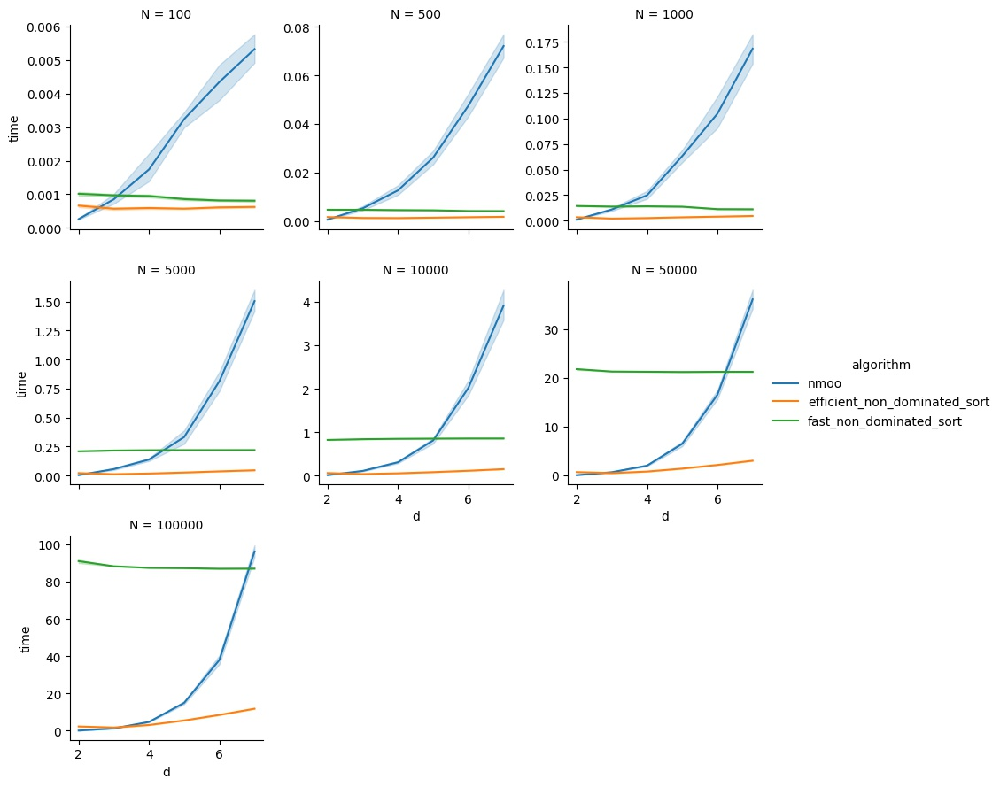
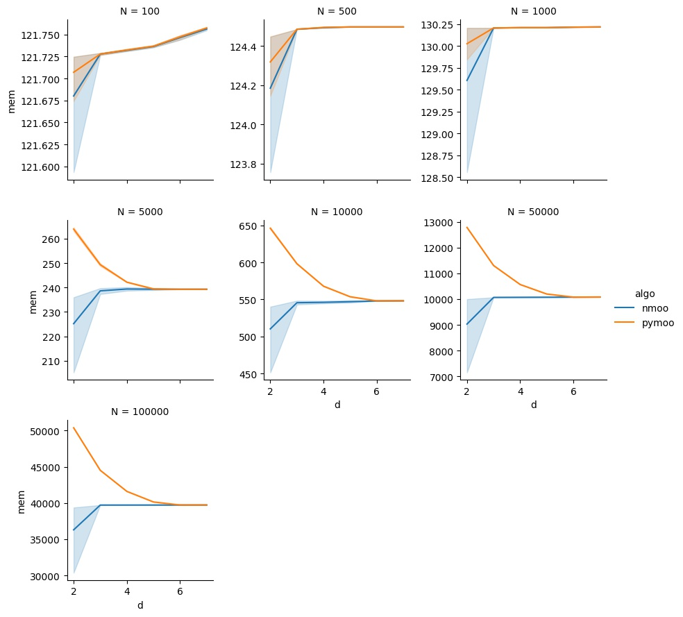

# Statement

This directory contains scripts to benchmark the algorithms of `pymoo v0.5.0`
and `nmoo 4.3.4` for the "Pareto selection problem":

> Calculate the Pareto front of an array `arr` of N points in R^d

The following methods are considered:
* `pymoo`'s `NonDominatedSorting` with `method="efficient_non_dominated_sort"`;
* `pymoo`'s `NonDominatedSorting` with `method="fast_non_dominated_sort"`;
* `nmoo`'s`nmoo.utils.population.pareto_frontier_mask`.

# Results

## Time

## Memory

