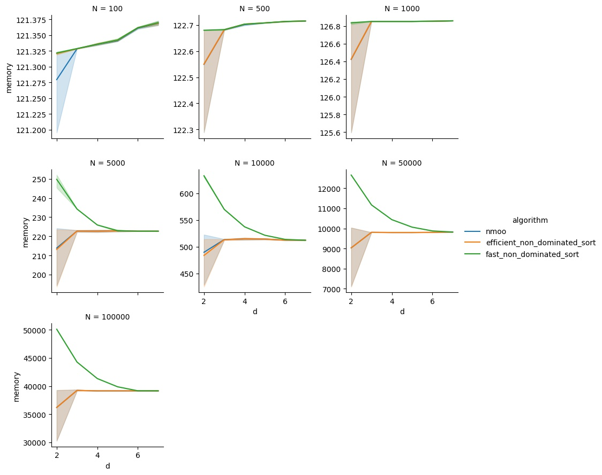

This directory contains scripts to benchmark the algorithms of `pymoo v0.5.0`
and `nmoo 4.3.4` for the "Pareto selection problem":

> Calculate the Pareto front of an array `arr` of N points in R^d

Specifically, the following two methods are considered:
* `pymoo`: first, the array `arr` is converted into a `Population` object
  (expensive!), and the `pymoo.util.optimum.filter_optimum` method is applied,
  which outputs another `Population` object; the ressources required to get
  from an array to a `Population` and back is not measured;
* `nmoo`: the `nmoo.utils.population.pareto_frontier_mask` method is used,
  which outputs a mask (array of booleans); the ressources required to get the
  actual Pareto points from the mask is not measured (and negligible).

# Results

The benchmarks were run on an AWS EC2 m6i.32xlarge.

## Time

Running
```sh
python3 time.py
```
outputs `time.csv` and the following plots (the x-axis represents d):


## Memory

Running
```sh
python3 memory.py
```
outputs `memory.csv` and the following plots (the x-axis represents d):


